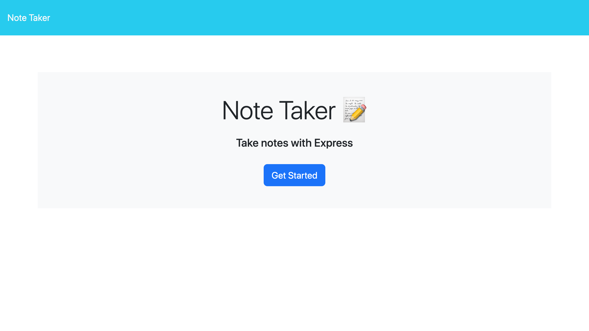
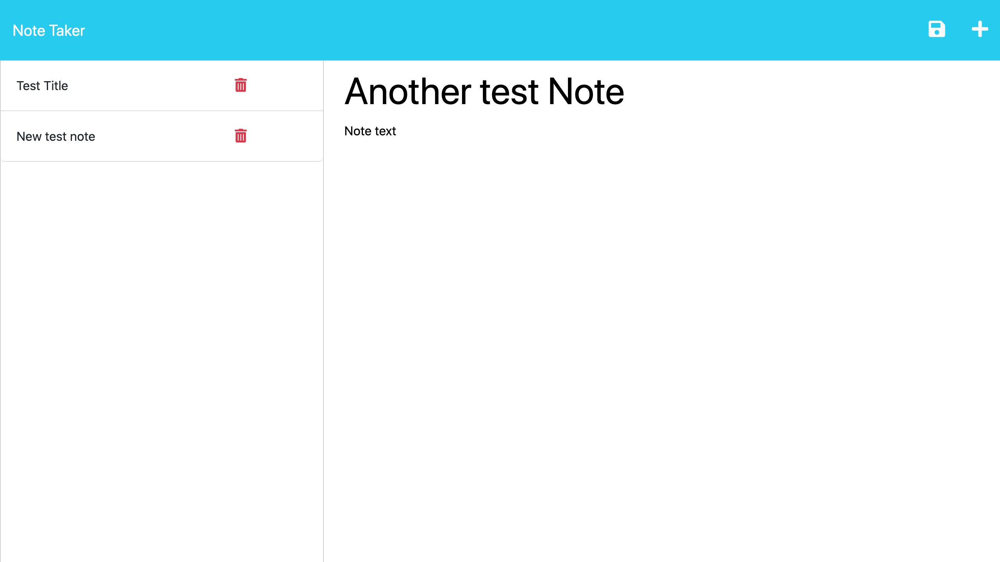
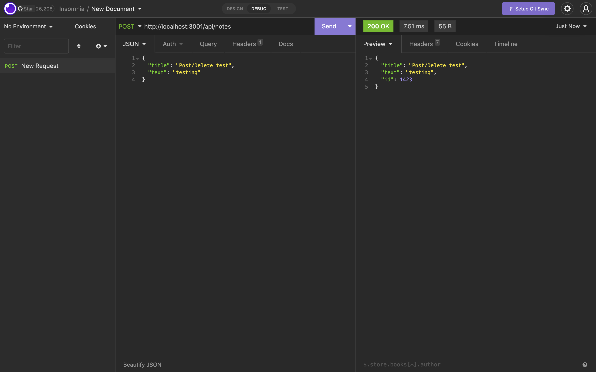
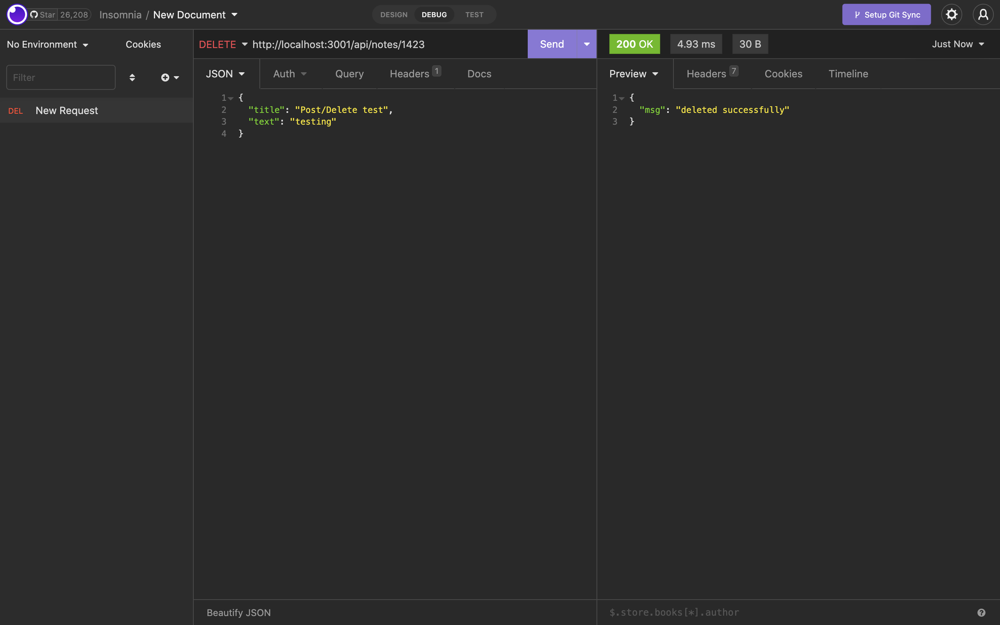

# Note Taker Challenge

## Description
---
Using the Note Taker application is a simple and easy way to take and save notes for later. This application uses Express.js to handle the back end data which holds the users notes data. POST, GET and DELETE routes can be checked using insomnia.

## Usage
---
On the home page you will see a "Get Started" button, press the button to begin taking notes. On the note taking page ou will see your saved notes on the left side and a text box to take notes to the right. You can give each note a title and a body of text, once the save button is clicked the new note will appear to the list of notes the the left. To delete a note, simply click the red trash can icon for the specific note.

## Installation
---
To install this project to get the development environment running:

1. Clone GitHub repository here: https://github.com/aHoff6/note-taker-challenge
by clicking the green "code" button and copying the URL.

2. Open the Command Line and change the directory to where you would like to clone the directory.

3. Type the command "git clone" followed by the URL you copied earlier and press enter.

4. Install dependencies with `npm install`

5. Run `npm start` to start up local server.

## Reference picture
---

## Deployed Link
---
https://young-falls-57358.herokuapp.com/
